### CSS Layout Challenge

As a front end developer, you will often be handed comps from a designer that you then have to build. You will need to be able to take a graphic file and recreate it with code. This means that you'll have to be able to think through how you're going to get all the elements in that comp where they need to be, and that requires a solid understanding of how to position HTML elements with CSS.

#### Getting Started

In this exercise, we'll take a series of simple comps and recreate each in [CodePen](http://codepen.io/). You will make the appropriate number of `<div>` tags with the div numbers indicated in the comps, give them a `<height>`, `<width>`, and `background-color` and then make them match the layout in the comp. Here's an example of what this might look like in your HTML and CSS:

Your HTML:

```HTML
<div class="div1">
  div1
</div>

<div class="div2">
  div2
</div>
```
Your CSS:

```CSS
div {
  width: 100px;
  height: 100px;
  background-color: black;
  color: white;
}
.div1 {
  float: right;
}

.div2 {
  float: left;
}
```

#### Tips:
* Remember, we've talked about several ways to position elements on the page. These include but are not necessarily limited to `display: block` and `display: inline-block`, `position: relative` and `position: absolute`, `margin`, `padding`, and the infamous `float`.
* If the layout dictates, some of the divs may be nested within other divs. Use your best judgement!
* See how many different ways you can achieve the same result and consider the pros/cons of solution!


### The Comps


##### Challenge 1:

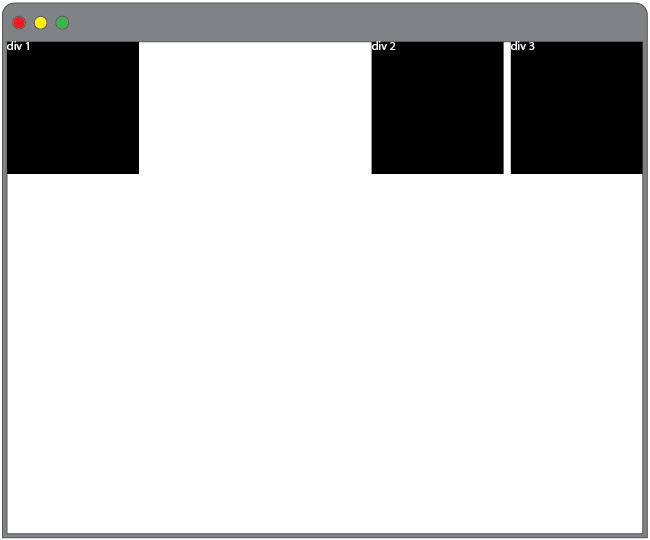


##### Challenge 2:

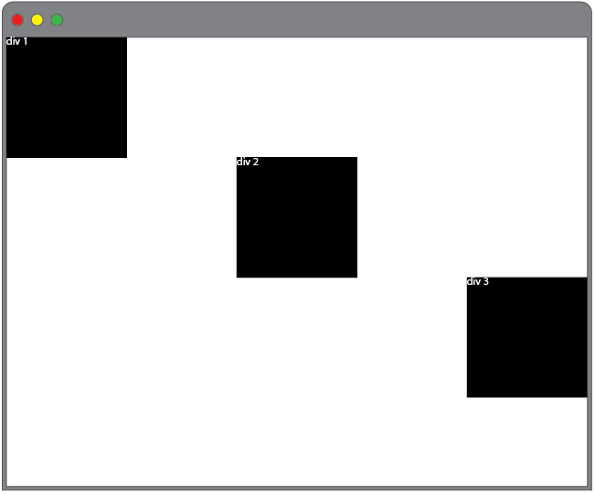


##### Challenge 3:


##### Challenge 4:

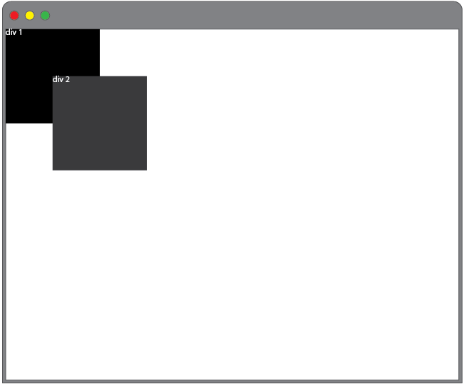


##### Challenge 5:

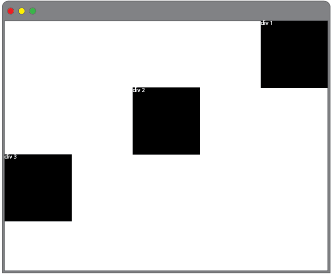


##### Challenge 6:

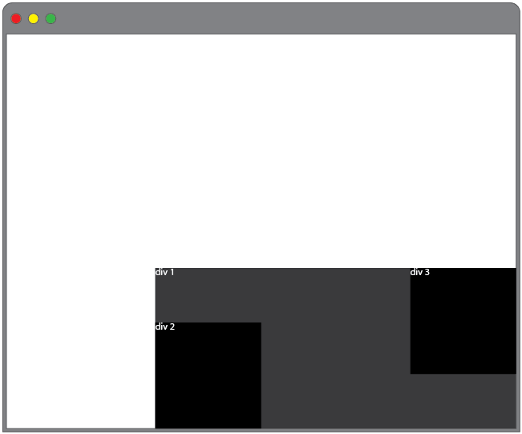


##### Challenge 7:

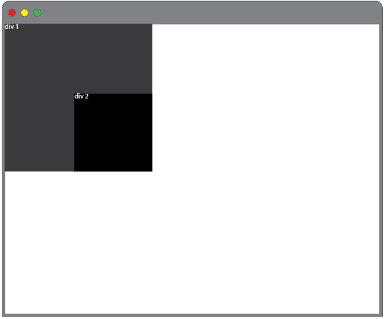


##### Challenge 8:

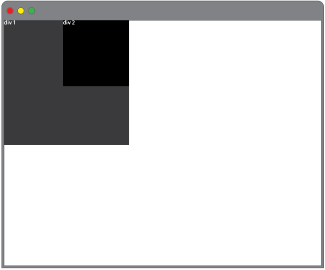


##### Challenge 9:

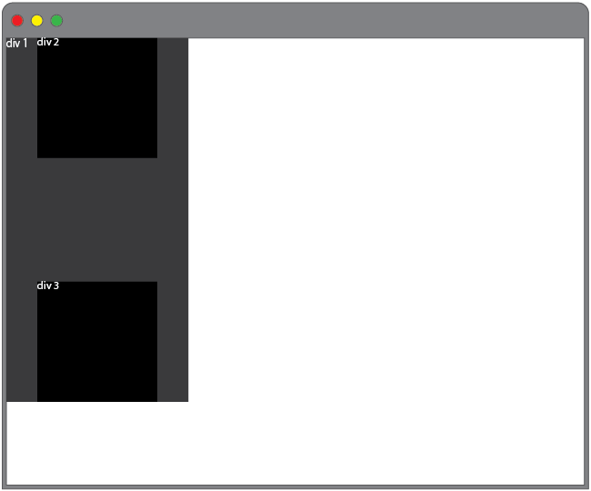


##### Challenge 10:

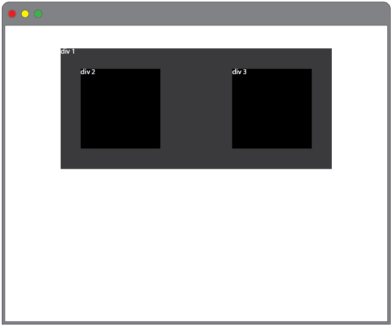


##### Challenge 11:

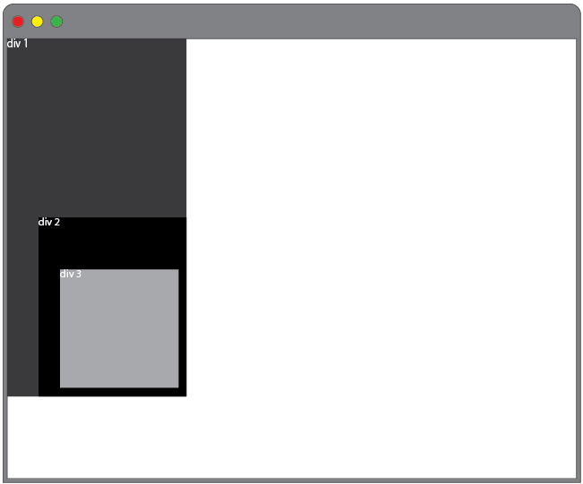


##### Challenge 12:

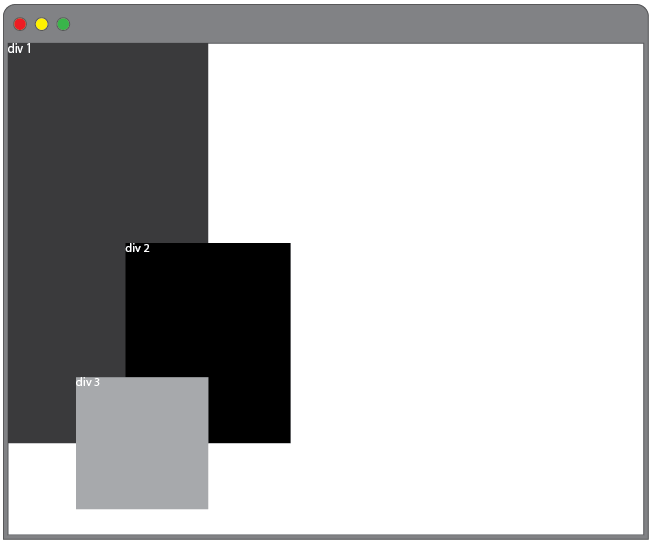


##### Challenge 13:

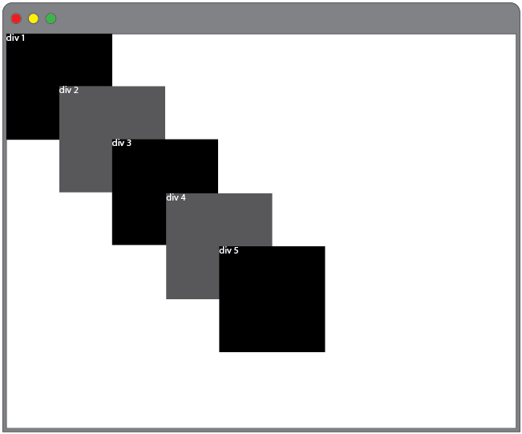


##### Challenge 14:

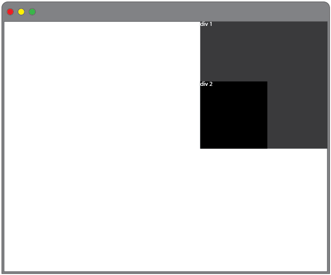


##### Challenge 15:

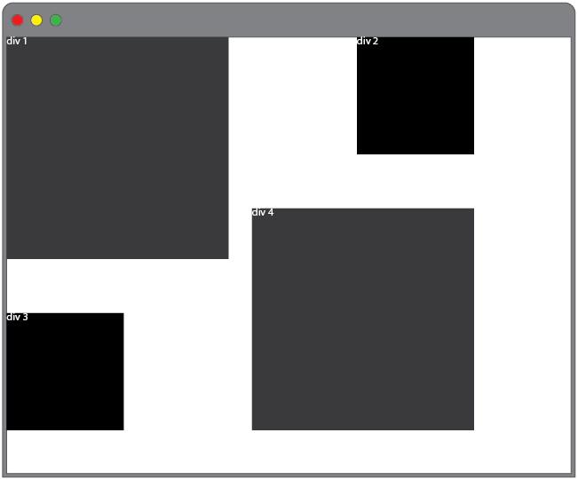
